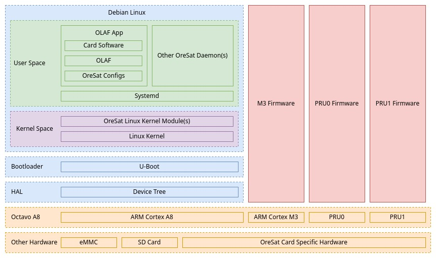

OreSat Software Stack
=====================

.. note:: This is only relevant to software on Linux cards on the satellite, not any software
   for UniClOGS or OreSat testing projects.

Octavo A8
---------

All OreSat Linux cards use a `Octavo A8`_, specifically the OSD3358-1G-BSM.

A very similar SOC can be commonly found in `BeagleBoard`_'s `PocketBeagle`_.

Key features of the `Octavo A8`_:

    - A single core 1GHz AM335x ARM Cortex-A8 processor
    - A deep sleep ARM Cortex-M3 processor
    - 2x 200Mhz PRU (Programmable Real-time Unit)
    - 512MB or 1GB of RAM (OreSat cards use the 1GB model)
    - 3D Graphics Accelerator
    - 6x UART buses
    - 2x CAN buses
    - 3x I2C buses
    - 2x SPI buses
    - 8-channel 12-bit ADC
    - 114x GPIO pins

See https://octavosystems.com/octavo_products/osd335x-sm/ for a full list of features of the Octavo
A8.

ARM Cortex A8
*************

The main processor of the `Octavo A8`_. It is a single core 1GHz AM335x ARM Cortex-A8 processor.

ARM Cortex M3
*************

The deep sleep processor. The Main Cortex A8 can be powered down and the Cortex M3 can run in
lower state. For non-C3 cards this is not needed, as those cards will just be powered off when
no needed. This could be really useful for C3, but is not currently used.

See https://git.ti.com/git/processor-firmware/ti-amx3-cm3-pm-firmware

PRUs
****

The PRUs (Programmable Real-time Units) are a microcontroller that shares pins and other
resource with the core processor allowing for custom interface to other hardware like cameras.
The AM335x has two PRUs. For OreSat an idea is use them to get images from image sensors.

All information and guides about PRU can be found at: `TI PRU-ICSS / PRU_ICSSG`_

HAL
---

Device Tree
***********

Device trees are used to describe the hardware, so hardware info does need to be hard-coded into
the Linux kernel; this include configuring pin modes. For more info about device tree and Linux,
see https://www.kernel.org/doc/html/latest/devicetree/usage-model.html.

Most the AM335x pins have 8 modes they can be configured between.
See https://www.ti.com/lit/ds/symlink/am3358.pdf for all the modes.

OreSat card device tree can be found at
https://github.com/oresat/oresat-linux/tree/master/image_builder/device_trees

Bootloader
----------

U-Boot
******

The first piece of software booted up on the AM335x is U-Boot.

U-Boot will read the AM335x EEPROM to figure out what specific device it is, the U-Boot will
load the device tree associated based of that EEPROM value, and then boot Linux and pass off
the device tree to the Linux kernel.

See `U-Boot`_ more info.

Debian Linux
------------

All OreSat Linux image are built with `BeagleBoard`_'s image-builder. OreSat image configs and
build script (which wrap around image-builder) can be found at
https://github.com/oresat/oresat-linux/tree/master/image_builder.

Kernel Space
************

Kernel
^^^^^^

All Linux cards use the 5.10 LTS Debian kernel built by `BeagleBoard`_ as it has support for
PRUs on the `Octavo A8`_ and just works.

Kernel Modules
^^^^^^^^^^^^^^

All OreSat Linux kernel module use `DKMS`_ as it will make installing and packaging kernel module
easier. Also, it's nice to no worry about updating kernel modules if the kernel needs to be
updated.

All kernel module will be put in a Debian package, so it can easily be updated with the updater
build into `OLAF`_ and used to build to flight OreSat Linux images.

User Space
**********

Only `dpkg`_  will be used for installing all non-Python package, with exception of ``python3``,
``python3-all``, ``python3-setuptools``, and ``python3-pip`` Debian packages. All other Python
packages will be installed with `pip`_.

OLAF App
^^^^^^^^

.. note::  This is just a high level overview for OLAF. For specifics, see
   `OLAF Read the Docs`_ .

OreSat Linux App Framework (aka OLAF) is a Pythonic application framework for all OreSat Linux
cards. It is built on top on `python-canopen`_. It is designed to handle all the common OreSat
CANopen Node functionality including support for ECSS CAN Bus Extended Protocol, file transfer
over CAN, and updating the Linux card thru Python packages, Debian packages, and bash scripts.

Each oresat card will have its own OLAF-based app that will be daemonized that will be the main
process for the card. This OLAF app will put health and status info out on the CAN bus, as well
as let the C3 command it over the CAN bus.

Non-OLAF apps
^^^^^^^^^^^^^

Non-OLAF apps can be used, but if possible it should be avoided, it's hard enough to maintain
all the OreSat software projects.

Any non-OLAF app should have interfaces (like sockets), that OLAF app can connect to get health
/ status info as well as control the non-OLAF app.

All Python projects will package and hosted on `PyPI`_ and all non-Python projects will have
Debian packages, so they can be updated thru OLAF and be used to build flight OreSat Linux
images.

.. OreSat repos
.. _OLAF: https://github.com/oresat/oresat-olaf

.. OreSat Read the Docs
.. _OLAF Read the Docs: https://oresat-olaf.readthedocs.io/en/latest/

.. Other repos
.. _DKMS: https://github.com/dell/dkms
.. _python-canopen: https://github.com/christiansandberg/canopen

.. Other links
.. _dpkg: https://www.dpkg.org/
.. _pip: https://pypi.org/project/pip/
.. _PyPI: https://pypi.org
.. _TI: https://www.ti.com/processors/sitara-arm/am335x-cortex-a8/overview.html
.. _Octavo A8: https://octavosystems.com/octavo_products/osd335x-sm/
.. _BeagleBoard: https://beagleboard.org/
.. _PocketBeagle: https://beagleboard.org/pocket
.. _U-Boot: https://u-boot.readthedocs.io/en/latest/
.. _TI PRU-ICSS / PRU_ICSSG: http://software-dl.ti.com/processor-sdk-linux/esd/docs/latest/linux/Foundational_Components_PRU-ICSS_PRU_ICSSG.html
